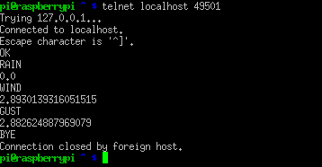

# Χειροκίνητη ρύθμιση του λογισμικού του Μετεωρολογικού Σταθμού.

Για να ρυθμίσετε το μετεωρολογικό σταθμό δε χρειάζεται προηγούμενη εμπειρία. Χρειάζεται να γίνουν αρκετά βήματα, αλλά τελειώνοντάς τα θα έχετε μάθει αρκετά πράγματα για τους αισθητήρες και το σταθμό. Θα έχετε αποκτήσει μια πρώτη επαφή με τη γραμμή εντολών, το διορθωτή κειμένου nano και τη βάση δεδομένων MySQL. Είναι επίσης μια πολύ καλή εισαγωγή στο Linux.

Αν διαβάσετε τον αρχικό αγγλικό οδηγό θα δείτε ότι προτείνει να συναρμολογήσετε πρώτα το σταθμό και το Raspberry και μετά να ρυμίσετε το λογισμικό.
Σας προτείνω να μην το κάνετε με αυτή τη σειρά, αλλά να ρυθμίστε πρώτα το λογισμικό.


## Χειροκίνητη Εγκατάσταση

1. Ξεκινήστε με μια φρέσκια εγκατάσταση της τελευταίας έκδοσης του [Raspbian](https://www.raspberrypi.org/downloads/raspbian/).
1. Όταν εκκινήσει για πρώτη φορά το Raspberry Pi, θα δείτε την επιφάνεια εργασίας του στα αγγλικά.

1. Από το Μενού πάνω αριστερά, επιλέξτε `Preferences` > `Raspberry Pi Configuration`.
    
1. Σας προτείνουμε να **αλλάξετε τον κωδικό** από το κουμπί που είναι από κάτω.

1. Στην καρτέλα Interfaces, ενεργοποιήστε το I2C:

    
    
1. Θα σας ζητηθεί να κάνετε επανεκκίνηση. Επιλέξτε "Yes". 

## Ρύθμιση του ρολογιού (RTC)

Θα κάνουμε την περισσότερη δουλειά από γραμμή εντολών. Ανοίξτε ένα τερματικό, χρησιμοποιώντας το εικονίδιο από τα πάνω εικονίδι ή πατώντας `ctrl`+`alt`+`t`.

    

θα δείτε το παρακάτω:

```bash
pi@raspberrypi: ~ $
```

Μπορείτε τώρα να πληκτρολογήσετε τις παρακάτω εντολές.

Πρέπει, όμως, πρώτα να κατεβάσετε τα απαραίτητα αρχεία: 

```bash
cd ~ && git clone https://github.com/raspberrypi/weather-station
```

Έχουμε συμπεριλάβει ένα σενάριο εγκατάστασης για να ρυθμιστεί αυτόματα το ρολόι πραγματικού χρόνου. Μπορείτε να το εκτελέσετε ή να ακολουθήσετε τις οδηγίες που ακολουθούν για να ρυθμίσετε το ρολόι με το χέρι. Σας προτείνουμε το αρχείο εγκατάστασης!

## Εγκατάσταση ρολογιού

Βεβαιωθείτε πρώτα ότι έχετε τις τελευταίες ενημερώσεις για το Raspberry Pi με τις παρακάτω εντολές:

```bash
sudo apt-get update && sudo apt-get upgrade
```

Θα πρέπει να κάνετε κάποιες αλλαγές σε ένα αρχείο ρυθμίσεωνγια να επιτρέψετε στο Raspberry Pi να χρησιμοποιήσει το ρολόι:

```bash
sudo nano /boot/config.txt
```

Προσθέστε τις παρακάτω γραμμές στο τέλος του αρχείου:

```bash
dtoverlay=w1-gpio
dtoverlay=pcf8523-rtc
```

Πατήστε **Ctrl + O** μετά **Enter** για να αποθηκεύσετε το αρχείο, και **Ctrl + X** για να βγείτε από nano.

Τώρα ρυθμίστε τις απαραίτητες μονάδες να ξεκινούν αυτόματα κατά την εκκίνηση:

```bash
sudo nano /etc/modules
```

Προσθέστε τις παρακάτω γραμμές στο τέλος του αρχείου:

```bash
i2c-dev
w1-therm
```

Πατήστε **Ctrl + O** μετά **Enter** για να αποθηκεύσετε το αρχείο, και **Ctrl + X** για να βγείτε από nano.

Για τα επόμενα βήματα, η πρόσθετη πλακέτα θα πρέπει να είναι συνδεμένη με το Raspberry Pi:

```bash
sudo halt
```

Κάντε επανεκίνηση για να εφαρμοστούν οι αλλαγές:

```bash
sudo reboot
```

Ελέξτε ότι το ρολόι εμφανίζεται στο φάκελο με τις συσκευές `/dev`:

```bash
ls /dev/rtc*
```

Θα πρέπει να δείτε κάτι σαν `/dev/rtc0`.

## Ρύθμιση του ρολογιού με τη σωστή ώρα

Χρησιμοποιήστε την εντολή `date` για να ελέξετε ότι η ώρα του συστήματος είναι σωστή. Αν όντως είναι σωστή, μπορείτε να ρυθμίσετε του ρολόι πραγματικού χρόνου από το ρολόι του συστήματος με την ακόλουθη εντολή:

```bash
sudo hwclock -w
```
Αν δεν είναι σωστή, τότε ρυθμίστε την ώρα του ρολογιού πραγματικού χρόνου με την παρακάτω εντολή. Θα χρειαστεί να αλλάξετε την παράμετρο `--date`, δίνοντάς της ως τιμή την ημερομηνία και ώρα που έχετε εσείς την ώρα που εκτελείται την εντολή.
Αν δεν το κάνετε, ημερομηνία θα οριστεί στα μεσάνυχτα της 1ης Ιανουαρίου 2014.

```bash
sudo hwclock --set --date="yyyy-mm-dd hh:mm:ss" --utc
```

Για παράδειγμα:

```bash
sudo hwclock --set --date="2017-02-18 18:32:00" --utc
```

Ορίστε μετά την ώρα του συστήματος από την ρολόι πραγματικού χρόνου:

```bash
sudo hwclock -s
```
Τώρα πρέπει μα ενεργοποιήσετε τη ρύθμιση του ρολογιού του συστήματος αυτόματα κατά την εκκίνηση. Επεξεργαστείτε πρώτα τον κανόνα στο αρχείο `/lib/udev/`:
Πρέπει να ενεργοποιήσετε την αυτόματη ρύθμιση του ρολογιού πραγματικού χρόνου κατά την εκκίνηση του υπολογιστή. Για αρχή, επεξεργαστείτε τον κανόνα στο `/lib/udev/`:

```bash
sudo nano /lib/udev/hwclock-set
```
Βρείτε τις γραμμές προς το τέλος που είναι:

```bash
if [ yes = "$BADYEAR" ] ; then
    /sbin/hwclock --rtc=$dev --systz --badyear
else
    /sbin/hwclock --rtc=$dev --systz
fi
```

Αλλάξτε τις επιλογές `--systz` σε `--hctosys` έτσι ώστε να γράφει:

```bash
if [ yes = "$BADYEAR" ] ; then
    /sbin/hwclock --rtc=$dev --hctosys --badyear
else
    /sbin/hwclock --rtc=$dev --hctosys
fi
```

Πατήστε **Ctrl + O** και **Enter** για να αποθηκεύσετε, και **Ctrl + X** για να κλείσετε το nano.

## Απομάκρυνση του πακέτου ψεύτικου ρολογιού (fake hardware clock)

Χρησιμοποιοιήστε την ακόλουθη εντολή για να απομακρύνετε το πακέτο αυτό:

```bash
sudo update-rc.d fake-hwclock remove
sudo apt-get remove fake-hwclock -y
```

## Έλεγχος των αισθητήρων

### Εγκατάσταση των απαραίτητων πακέτων λογισμικού

Ανάψτε το Raspberry Pi και συνδεθείτε.

Από τη γραμμή εντολών πληκτρολογήστε τα ακόλουθα: 

```bash
sudo apt-get install i2c-tools python-smbus telnet -y
```

Ελέξτε ότι οι συσκευές I2C devices λειτουργούν:

```bash
sudo i2cdetect -y 1
```

Πρέπει να δείτε κάτι σαν το ακόλουθο:

```
	 0  1  2  3  4  5  6  7  8  9  a  b  c  d  e  f
00:          -- -- -- -- -- -- -- -- -- -- -- -- -- 
10: -- -- -- -- -- -- -- -- -- -- -- -- -- -- -- -- 
20: -- -- -- -- -- -- -- -- -- -- -- -- -- -- -- -- 
30: -- -- -- -- -- -- -- -- -- -- -- -- -- -- -- -- 
40: 40 -- -- -- -- -- -- -- -- -- -- -- -- -- -- -- 
50: -- -- -- -- -- -- -- -- -- -- -- -- -- -- -- -- 
60: -- -- -- -- -- -- -- -- UU 69 6a -- -- -- -- -- 
70: -- -- -- -- -- -- -- 77                         
```

- `40` = HTU21D, ο αισθητήρας υγρασίας και θερμοκρασίας.
- `77` = BMP180, ο αισθητήρας βαρομετρικής πίεσης.
- `68` = PCF8523, το ρολόι πραγματικού χρόνου. Θα εμφανιστεί ως `UU` γιατί είναι δεσμευμένο από τον οδηγό.
- `69` = MCP3427, ο μετατροπέας αναλογικού σήματος σε ψηφιακό στη μητρική.
- `6a` = MCP3427, ο μετατροπέας ψηφιακού σήματος σε αναλογικού στη μητρική.

Παρατήρηση: Τα `40`, `77` και `6a` θα εμφανιστούν μόνο αν έχετε συνδέσει την πλακέτα **ΑΕΡΑ** με τη μητρική πλακέτα.

Τώρα που δουλεύουν οι αισθητήρες, χρειαζόμαστε μια βάση δεδομένων για να αποθηκεύσουμε τα δεδομένα που πέρνουμε από αυτούς.
## Ρύθμιση Βάσης Δεδομένων

Θα ρυθμίσετε τώρα το σταθμό να αποθηκεύει αυτόματα τα δεδομένα που συνέλλεξε. Τα δεδομένα αποθηκεύονται στην κάρτα SD του Raspberry Pi σε μια βάση δεδομένων που λέγετε MySQL. Μόλις ο σταθμός αποθηκεύσει τα δεδομένα τοπικά, θα μπορείτε επίσης να τα [μεταφορτώσετε](oracle.md) σε μια κεντρική βάση δεδομένωn της Oracle Apex για να τα μοιράζεστε και με άλλους. 

### Εγκατάσταση απαραίτητων πακέτων λογισμικού

Στη γραμμή εντολών πληκτρολογήστε:

```bash
sudo apt-get update
sudo apt-get install apache2 mysql-server python-mysqldb php5 libapache2-mod-php5 php5-mysql -y
```
  
Αν κάνετε κάποιο λάθος, πατήστε το πάνω βελάκι για να επεξεργαστείτε μια προηγούμενη εντολή.

Κατά τη διάρκεια της εγκατάστασης θα σας ζητηθεί να δημιουργήσετε και να επαληθεύσετε έναν κωδικό για το διαχειριστή του εξυπηρετητή βάσης δεδομένων MySQL. Μην τον ξεχάσετε, θα τον χρειαστείτε αργότερα.

### Δημιουργία τοπικής βάσης δεδομένων

Γράψτε την ακόλουθη εντολή:

```bash
mysql -u root -p
```

Βάλτε τον κωδικό που ορίσατε κατά τη διάρκεια της εγκατάστασης του εξυπηρετητή MySql παραπάνω.

Θα δείτε το `mysql>` είστε έτοιμοι να δημιουργήσετε τη βάση δεδομένων:

```mysql
CREATE DATABASE weather;
```

Πρέπει να δείτε `Query OK, 1 row affected (0.00 sec)`.

Ας αλλάξουμε στη βάση αυτή:

```mysql
USE weather;
```

Πρέπει να δείτε `Database changed`.

Αν η MySQL δεν κάνει αυτό που πρέπει ή εμφανίζει λάθη, το πιθανότερο είναι να έχετε ξεχάσει το τελικό `;`. Απλά πληκτρολογήστε το και πατήστε **Enter**.
  
### Δημιουργία πίνακα στη βάση

Ο πρωτότυπος οδηγός προτείνει να πληκτρολογήσετε τον παρακάτω κώδικα, δίνοντας και τις ακόλουθες συμβουλές: 

- Μην ξεχάσετε τα κόμματα στο τέλος των γραμμών.
- Χρησιμοποιήστε το πάνω βελάκι στο πληκτρολόγιο για να αντιγράψετε και να επεξεργαστείτε μια από τις προηγούμενες γραμμές καθώς είναι παρόμοιες.
- Πληκτρολογήστε τον κώδικα προσεκτικά και **ακριβώς** όπως τον βλέπετε, αλλιώς υπάρχει περίπτωση να υπάρχει πρόβλημα αργότερα.
- Χρησιμοπιήστε CAPS LOCK!
  
```
  CREATE TABLE WEATHER_MEASUREMENT(
    ID BIGINT NOT NULL AUTO_INCREMENT,
    REMOTE_ID BIGINT,
    AMBIENT_TEMPERATURE DECIMAL(6,2) NOT NULL,
    GROUND_TEMPERATURE DECIMAL(6,2) NOT NULL,
    AIR_QUALITY DECIMAL(6,2) NOT NULL,
    AIR_PRESSURE DECIMAL(6,2) NOT NULL,
    HUMIDITY DECIMAL(6,2) NOT NULL,
    WIND_DIRECTION DECIMAL(6,2) NULL,
    WIND_SPEED DECIMAL(6,2) NOT NULL,
    WIND_GUST_SPEED DECIMAL(6,2) NOT NULL,
    RAINFALL DECIMAL (6,2) NOT NULL,
    CREATED TIMESTAMP NOT NULL DEFAULT CURRENT_TIMESTAMP,
    PRIMARY KEY ( ID )
  );
```

Θα δείτε κάτι σαν `Query OK, 0 rows affected (0.05 sec)`.

Ας το κάνετε λίγο διαφορετικά να γλυτώσετε γράψιμο και λάθη. Επιλέξτε και αντιγράψτε τις παραπάνω εντολές, από το 'CREATE έως το ); . 
Πατήστε  `Ctrl - D` ή πληκτρολογήστε `exit` και **ENTER** για να βγείτε από τη MySQL.

Από γραμμή εντολών γράψτε:
```
nano myscript.sql
```
Στο παράθυρο που θα εμφανιστεί Πατήστε δεξί κλικ και paste. Πρέπει να δείτε κάτι σαν την παρακάτω εικόνα:
  

Πατήστε **Ctrl + O** μετά **Enter** για να αποθηκεύσετε το αρχείο, και **Ctrl + X** για να βγείτε από το nano.

Γράψτε:
```
mysql -u root -p -h localhost weather < myscript.sql
```
Ο πίνακας δημιουργήθηκε στη βάση μας και είναι έτοιμος να δεχτεί τα δεδομένα μας.

## Εγκατάσταση το λογισμικού για τους αισθητήρες

Ξεκινήστε κατεβάζοντας τον κώδικα για την καταγραφή των δεδομένων. Μπορείτε να παραλείψετε αυτό το βήμα αν έχετε ήδη εγκαταστήσει το [ρολόι πραγματικού χρόνου](software-setup.md).

```
cd ~
git clone https://github.com/raspberrypi/weather-station.git
```
Θα δημιουργηθεί ένας νέος φάκελος μέσα στον προσωπικό σας με όνομα `weather-station`.

### Ξεκινήστε το δαίμονα του μετεωρολογικού σταθμού και δοκιμάστε τον

Σύμφωνα με την [Eισαγωγή στο Linux, Ένας πρακτικός οδηγός](http://www.it.uom.gr/teaching/linux/intro-linux-gr/intro-linux.html#sect_04_01), από το Πανεπιστήμιο Μακεδονίας:
> Οι δαίμονες (daemons) είναι διεργασίες διακομιστή που εκτελούνται συνεχώς. Συνήθως αρχικοποιούνται με την έναρξη του συστήματος και μετά περιμένουν στο παρασκήνιο μέχρι να ζητηθεί η συνδρομή τους.

Για να ξεκινήσετε το δαίμονα για το μετεωρολογικό σταθμό, εκτελέστε την παρακάτω εντολή:

```bash
sudo ~/weather-station/interrupt_daemon.py start
```
  
Πρέπει να δείτε κάτι σαν `PID: 2345` (ο αριθμός θα είναι διαφορετικός).
  
Για την παρακολούθηση του μετρητή βροχή και του ανεμόμετρου απαιτείται μια διαδικασία (πρόγραμμα) που εκτελείται συνέχεια. Οι αισθητήρες αυτοί είναι 
μαγνητικοί αισθητήρες reed και ο κώδικας χρησιμοποιεί [διακοπές.](http://www.it.uom.gr/project/mycomputer/r_usage/i_intro.html) 
Οι διακοπές αυτές μπορούν να συμβούν οποιαδήποτε στιγμή, σε αντίθεση με το τις μετρήσεις των άλλων αισθητήρων που γίνονται σε τακτικά χρονικά διαστήματα. 
Μπορείτε να χρησιμοποιήσετε το πρόγραμμα **telnet** για να τα δοκιμάσετε ή να τα παρακολουθήσετε με την ακόλουθη εντολή:
  
```bash
telnet localhost 49501
```
  
Θα πρέπει να δείτε κάτι σαν κι αυτό:

```
Trying 127.0.0.1...
Connected to localhost.
Escape character is '^]'.
OK
```

Μπορείτε να χρησιμοποιήσετε τις ακόλουθες εντολές:

- `RAIN`: εμφανίζει τον όγκο βροχής σε ml
- `WIND`: εμφανίζει τη μέση ταχύτητα ανέμου σε χ/ω
- `GUST`: εμφανίζει την ταχύτητα ριπών αέρα σε χ/ω
- `RESET`: μηδενίζει τους μετρητές διακοπής του μετρητή βροχής και του ανεμόμετρου.
- `BYE`: έξοδος

Με την εντολή `BYE` αποσυνδέεστε.

Αν ο υπολογιστής σας δεν έχει εγκατεστημένο εφαρμογή telnet, όπως συνήθως συμβαίνει στα windows,μπορείτε να χρησιμοποιήσετε το [putty](http://www.chiark.greenend.org.uk/~sgtatham/putty/latest.html?).
Είναι ένα ελεύθερο λογισμικό που ενσωματώνει πελάτη telnet και, ίσως ακόμα πιο σημαντικό, πελάτη ssh. Με το putty μπορείτε να συνδεθείτε στο 
raspberrypi απομακρυσμένα μέσω ssh και μετά με telnet, όπως περιγράφεται παραπάνω.

### Αυτόματη εκκίνηση του δαίμονα κατά την εκκίνηση του υπολογιστή

Χρησιμοποιήστε την ακόλουθη εντολή για να αυτοματοποιήσετε το δαίμονα:

```bash
sudo nano /etc/rc.local
```
  
Εισάγετε τις ακόλουθες γραμμές πριν από το `exit 0` στο τέλος του αρχείου:

```bash
echo "Ο δαίμονας του μετεωρολογικού σταθμού ξεκινά..."
    
/home/pi/weather-station/interrupt_daemon.py start
```

Πατήστε `Ctrl - O` και μετά `Enter` για να αποθηκεύσετε και `Ctrl - X` για να βγείτε από το nano.
    
### Ενημέρωση αρχείου ρυθμίσεων MySQL

Θα χρειαστεί να χρησιμοποιήσετε τον κωδικό του χρήστη root της MySQL που επιλέξατε κατά την εγκατάσταση. Αν **δεν** είστε στο φάκελο `weather-station`, γράψτε:

```bash
cd ~/weather-station
```

και μετά: 

```bash
nano credentials.mysql
```
  
Αλλάξτε το πεδίο password και βάλτε τον κωδικό που διαλέξατε κατά την εγκατάσταση της MySQL. Προσέξτε να μην διαγράψετε κατά λάθος τα διπλά εισαγωγικά `"` στις τιμές.
  
Πατήστε `Ctrl - O` και μετά `Enter` για να αποθηκεύσετε και `Ctrl - X` για να βγείτε από το nano.

## Αυτόματη ενημέρωση της βάσης δεδομένων

Τα προγράματα που χρειάζονται είναι τα `log_all_sensors.py` και `upload_to_oracle.py`. Αυτά καλούνται αυτόματα από ένα εργαλείο χρονοπρογραμματισμού εργασιών που ονομάζεται [cron](http://www.it.uom.gr/teaching/linux/intro-linux-gr/intro-linux.html#sect_04_04_04) και παίρνουν μετρήσεις αυτόματα. Οι μετρήσεις αποθηκεύονται στην τοπική βάση δεδομένων MySQL και στη βάση δεδομένων Oracle Apex στο διαδίκτυο [αν εγραφείτε](oracle.md).

Για να μπορέσετε να πέρνετε μετρήσεις αυτόματα πρέπει να ενεργοποιήσετε το cron. Αυτή η κατάσταση είναι γνωστή ώς **κατάσταση καταγραφής δεδομένων**: 

```bash
crontab < ~/weather-station/crontab.save
```

Ο σταθμός σας τώρα είναι ενεργός και καταγράφει δεδομένα σε τακτικά χρονικά διαστήματα.
  
Μπορείτε να απενεργοποιήσετε την κατάσταση καταγραφής δεδομένων όποτε θέλετε με την ακόλουθη εντολή:
  
```bash
crontab -r
```
  
Για να ενεργοποιήσετε την κατάσταση καταγραφής δεδομένων ξανά, χρησιμοποιήστε την εντολή:
  
```bash
crontab < ~/weather-station/crontab.save
```
  
Σημείωση: Αν δουλεύετε πάνω στα [μαθήματα](https://github.com/raspberrypilearning/weather-station-sow) δε θα πρέπει να έχετε ενεργοποιημένη την κατάσταση καταγραφής δεδομένων.
  
### Χειροκίνηση μέτρηση

Μπορείτε να πάρετε μια μέτρηση όποτε θέλετε με την ακόλουθη εντολή:

```bash
sudo ~/weather-station/log_all_sensors.py
```
  
Μην ανησυχήσετε αν δείτε το μήνυμα `Warning: Data truncated for column X at row 1`: είναι κάτι αναμενόμενο.

  
### Προβολή των δεδομένων της βάσης 

Δώστε την ακόλουθη εντολή:

```bash
mysql -u root -p
```
  
Πληκτρολογήστε τον κωδικό του διαχειριστή της MySql. Αλλάξτε στη βάση δεδομένων `weather`:
  
```bash
USE weather;
```
  
Εκτελέστε ένα ερώτημα επιλογής για να δείτε τα περιεχόμενα του πίνακα `WEATHER_MEASUREMENT`:

```bash
SELECT * FROM WEATHER_MEASUREMENT;
```


  
Αφού καταγραφούν πολλές μετρήσεις, θα είναι λογικό να επιλέγετε μόνο τις εγγραφές που δημιουργήθηκαν μετά από κάποια ημερομηνία. Για παράδειγμα η παρακάτω εντολή εμφανίζει τις εγγραφές που δημιουργήθηκαν μετά την 01/04/2017:
  
```bash
SELECT * FROM WEATHER_MEASUREMENT WHERE CREATED > '2017-04-01 12:00:00';
```
Πατήστε **Ctrl + D** ή γράψτε `exit` και πατήστε το `enter` για να αποσυνδεθείτε από τη MySQL.

## Ανέβασμα δεδομένων στη βάση δεδομένων Oracle Apex

Στη φάση αυτή, έχετε ένα μετεωρολογικό σταθμό που διαβάζει τους αισθητήρες του και αποθηκεύει τα δεδομένα σε τακτικά χρονικά διαστήματα σε μια βάση δεδομένων στην κάρτα SD. Αλλά τι θα γίνει αν η κάρτα χαλάσει; Πως θα κρατήσετε αντίγραφα των δεδομένων σας; Και πως θα τα μοιραστείτε με τον υπόλοιπο κόσμο;

Η εταιρία Oracle έχει δημιουργήσει μια κεντρική βάση δεδομένων που επιτρέπει σε όλα τα σχολεία που συμμετέχουν στο έργο του Μετεωρολογικού Σταθμού να ανεβάζουν τα δεδομένα τους. Στη βάση αυτή τα δεδομένα είναι ασφαλή και μπορείτε να τα κατεβάσετε σε διάφορες μορφές, να τα μοιραστείτε, ακόμα και να δημιουργήσετε γραφήματα και αναφορές. Ας δούμε πως γίνεται αυτό.
Automate updating of the database
### Εγγραφή του σχολείου σας

Θα πρέπει να [εγγράψετε το σχολείο σας](oracle.md) και να προσθέσετε το μετεωρολογικό σας σταθμό. Επιστρέψτε εδώ όταν έχετε τον κωδικό του σταθμού σας.

### Ενημέρωση αρχείου διαπιστευτηρίων με τις λεπτομέριες του σταθμού σας

Με τις ακόλουθες εντολές μπορείτε να προσθέσετε το όνομα και τον κωδικό του σταθμού σας στο τοπικό αρχείο διαπιστευτηρίων της Oracle. Το πρόγραμμα που ανεβάζει τα δεδομένα του σταθμούας στην Oracle θα τα προσθέτει στο σωστό μετεωρολογικό σταθμό.

```bash
cd ~/weather-station

nano credentials.oracle.template
```
  
Αντικαταστήστε τα πεδία `name` and `key` με τις τιμές των πεδίων `Weather Station Name` και `Passcode` του μετεωρολογικού σας σταθμού. Τα διπλά εισαγωγικά `"` που περικλείουν τις τιμές είναι σημαντικά. Προσέξτε λοιπόν να μην τα διαγράψετε κατά λάθος. Το όνομα του σταθμού πρέπει να είναι ακριβώς το ίδιο και ισχύει η διάκριση πεζών - κεφαλαίων.
  
Πατήστε `Ctrl - O` και μετά `Enter` για να αποθηκεύσετε και `Ctrl - X` για να βγείτε από το nano.
  
Αλλάξτε το όνομα του αρχείου για να το ενεργοποιήσετε:

```bash
mv credentials.oracle.template credentials.oracle
```
  
### Έλεγχος αποστολής δεδομένων

Κάντε χειροκίνητα μια αποστολή δεδομένων με την ακόλουθη εντολή:

```bash
sudo ~/weather-station/upload_to_oracle.py
```

Συνδεθείτε στο [λογαριασμό σας στο Oracle Apex ](oracle.md) και πηγαίνετε στο 'Weather Measurements'. Πρέπει να δείτε τις μετρήσεις του σταθμού σας:


Μπορείτε να κατεβάσετε τα δεδομένά σας σε διάφορες μορφές και επίσης να φτιάξετε διαγράμματα χρησιμοποιόντας το μενού:


## Επόμενα βήματα

- Μπορείτε τώρα να συνεχίσετε με τη ρύθμιση του υπόλοιπου υλικού στο [τμήμα ρύθμισης υλικού](build2.md)
